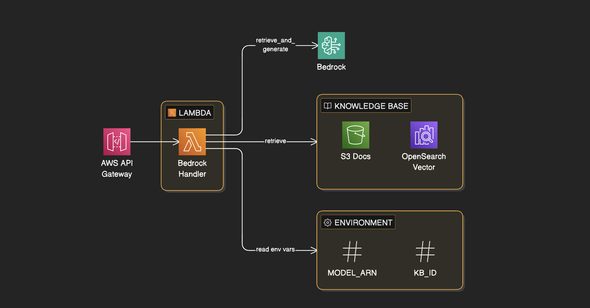

# Serverless RAG Implementation with AWS

A production-ready **Retrieval Augmented Generation (RAG)** system built entirely on AWS serverless infrastructure. This project demonstrates how to build a scalable, cost-effective RAG application using AWS Bedrock, Lambda, API Gateway, and Knowledge Bases.

## 🚀 Live Demo

**🔗 [Try the Live Demo](https://main.d36rjjc7o1sdd7.amplifyapp.com/)**

Experience the RAG system in action with a retro terminal-style interface!

## 📋 Table of Contents

- [Overview](#overview)
- [Architecture](#architecture)
- [Project Structure](#project-structure)
- [Frontend Implementation](#frontend-implementation)
- [Backend Architecture](#backend-architecture)
- [Setup & Deployment](#setup--deployment)
- [Vector Store Options](#vector-store-options)
- [Cost Considerations](#cost-considerations)
- [Contributing](#contributing)

## 🎯 Overview

This project implements a serverless RAG (Retrieval Augmented Generation) system that combines the power of Large Language Models (LLMs) with semantic search capabilities. The system retrieves relevant context from a knowledge base and augments LLM responses with accurate, up-to-date information.

### Key Benefits

- **Fully Serverless**: No infrastructure management required
- **Scalable**: Automatically scales with demand
- **Cost-Effective**: Pay only for what you use
- **Production-Ready**: Built with AWS best practices
- **Secure**: Leverages AWS IAM and security features
- **Simple Frontend**: Pure HTML/CSS/JS - no frameworks, no build complexity

## 🏗️ Architecture



The system follows a clean, serverless architecture:

```
User → AWS Amplify (Static Site) → API Gateway → Lambda → [Bedrock LLM + Knowledge Base] → Response
```

### Architecture Flow

1. **Frontend (This Repository)**: 
   - Retro terminal-style web interface
   - Pure HTML/CSS/JavaScript (no frameworks)
   - Hosted on AWS Amplify
   - Makes POST requests to API Gateway endpoint

2. **AWS API Gateway**: 
   - RESTful API endpoint that handles incoming requests
   - CORS configured for Amplify domain
   - Request/response transformation

3. **AWS Lambda Function**: 
   - Serverless compute for RAG orchestration
   - Receives user queries from API Gateway
   - Initiates vector search in Knowledge Base
   - Calls Bedrock for LLM inference
   - Combines retrieved context with LLM generation
   - Returns augmented responses

4. **Amazon Bedrock**: 
   - LLM inference for generating responses
   - Knowledge Bases for managing vectorized data
   - Multiple foundation model support (Claude, Llama, etc.)

5. **Vector Store**: 
   - OpenSearch Serverless (or alternative) for semantic search
   - Stores document embeddings for retrieval

6. **Amazon S3**: 
   - Data source for Knowledge Base
   - Stores source documents (PDFs, text files, etc.)
   - Triggers Knowledge Base sync when updated

## 📁 Project Structure

This repository contains **only the frontend code** - a simple static website:

```
mlops-rag-serverless/
├── index.html          # Main HTML interface (retro terminal UI)
├── style.css           # Retro terminal styling (VT323 font, neon green theme)
├── app.js              # Frontend JavaScript (API calls, chat logic)
├── config.js           # Configuration (API URL injected by Amplify)
├── amplify.yml         # AWS Amplify deployment config
├── images/
│   └── image.png       # Architecture diagram
├── .gitignore          # Git ignore rules
└── README.md           # This file
```

**Note**: The backend logic (Lambda functions, Bedrock configuration, Knowledge Base setup) lives in AWS and is not part of this repository.

## 💻 Frontend Implementation

### Technology Stack

- **HTML5**: Semantic markup
- **CSS3**: Retro terminal styling with VT323 monospace font
- **Vanilla JavaScript**: No frameworks, no dependencies
- **AWS Amplify**: Static site hosting with environment variable injection

### Key Features

- ✅ **Retro Terminal UI**: Nostalgic command-line interface with CRT glow effects
- ✅ **Real-time Chat**: Type messages and receive streaming-style responses
- ✅ **Robotic Typing Animation**: Character-by-character response display
- ✅ **Error Handling**: Clear error messages for API failures and CORS issues
- ✅ **Zero Dependencies**: Pure frontend, no npm packages required

### How It Works

1. User types a message in the terminal input
2. JavaScript sends POST request to API Gateway endpoint
3. Response is received and displayed with typing animation
4. API URL is injected during Amplify build from environment variables

### Configuration

The API Gateway URL is configured via AWS Amplify environment variables:

1. Set `API_URL` environment variable in Amplify console
2. `amplify.yml` injects it into `config.js` during build
3. `app.js` reads `window.API_URL` from `config.js`

## 🔧 Backend Architecture

The backend is deployed separately in AWS and consists of:

### AWS Components

1. **API Gateway (REST API)**
   - Endpoint: `/ask` or similar
   - Method: POST
   - CORS enabled for Amplify domain
   - Request format: `{ "query": "user question" }`
   - Response format: `{ "answer": "response text", "citations": [...] }`

2. **Lambda Function**
   - Handles RAG orchestration
   - Integrates with Bedrock Knowledge Base
   - Calls Bedrock LLM for response generation
   - Returns formatted JSON response

3. **Amazon Bedrock**
   - Knowledge Base for document retrieval
   - Foundation model for LLM inference
   - Embedding model for semantic search

4. **Vector Store**
   - OpenSearch Serverless (or alternative)
   - Stores document embeddings
   - Performs semantic similarity search

5. **S3 Bucket**
   - Source documents storage
   - Knowledge Base data source

## 🚀 Setup & Deployment

### Prerequisites

- AWS Account with appropriate permissions
- AWS Amplify access
- Git repository (GitHub, GitLab, etc.)

### Frontend Deployment (This Repository)

1. **Clone the Repository**
   ```bash
   git clone https://github.com/amit-chaubey/mlops-rag-serverless.git
   cd mlops-rag-serverless
   ```

2. **Connect to AWS Amplify**
   - Go to AWS Amplify Console
   - Click "New app" → "Host web app"
   - Connect your Git repository
   - Select the branch (usually `main`)

3. **Configure Build Settings**
   - Amplify will auto-detect `amplify.yml`
   - No additional build commands needed (static site)

4. **Set Environment Variables**
   - In Amplify Console → App settings → Environment variables
   - Add: `API_URL` = `https://your-api-gateway-url.execute-api.region.amazonaws.com/stage/endpoint`

5. **Deploy**
   - Click "Save and deploy"
   - Amplify will build and deploy your site
   - Get your Amplify URL (e.g., `https://main.xxxxx.amplifyapp.com`)

### Backend Deployment (Separate Setup)

The backend components need to be set up separately in AWS:

1. **Create S3 Bucket** for document storage
2. **Set up Bedrock Knowledge Base** with your S3 bucket as data source
3. **Create Lambda Function** with:
   - Bedrock Knowledge Base integration
   - API Gateway trigger
   - Proper IAM permissions
4. **Deploy API Gateway** REST API
5. **Configure CORS** to allow your Amplify domain

### Lambda Function Requirements

The Lambda function needs IAM permissions for:
- `bedrock:InvokeModel` - For LLM inference
- `bedrock:Retrieve` - For Knowledge Base retrieval
- `bedrock:RetrieveAndGenerate` - For RAG workflow
- `s3:GetObject` - For accessing source documents
- `logs:CreateLogGroup`, `logs:CreateLogStream`, `logs:PutLogEvents` - For CloudWatch logging

## 🔍 Vector Store Options

### Current Status: OpenSearch Serverless (Disabled)

OpenSearch Serverless is currently **disabled** in this implementation due to cost considerations. While it offers excellent performance and AWS-native integration, it can be expensive for development and showcase projects.

### Alternative: Pinecone

For **showcase projects** and **development environments**, consider using **Pinecone** as a cost-effective alternative:

- **Pros**:
  - Free tier available for development
  - Pay-as-you-go pricing
  - Easy integration with Bedrock
  - Excellent performance
  - Simple API

- **Cons**:
  - External service (not AWS-native)
  - Additional vendor dependency

### Production Recommendations

For **production deployments**, choose your vector store based on:

1. **Budget**: 
   - OpenSearch Serverless: Higher cost, AWS-native
   - Pinecone: Lower cost, external service
   - Self-hosted: Initial setup cost, ongoing maintenance

2. **Demand/Scale**:
   - Low to medium traffic: Pinecone or smaller OpenSearch instances
   - High traffic: OpenSearch Serverless with auto-scaling
   - Enterprise: Dedicated OpenSearch cluster

3. **Requirements**:
   - **AWS-native only**: OpenSearch Serverless
   - **Cost-sensitive**: Pinecone or self-hosted
   - **Compliance**: Consider data residency requirements

## 💰 Cost Considerations

### Current Architecture Costs

- **AWS Amplify**: Free tier (5GB storage, 15GB bandwidth/month), then pay-as-you-go
- **API Gateway**: ~$3.50 per million requests
- **Lambda**: Pay per invocation and compute time (free tier: 1M requests/month)
- **Bedrock**: Pay per token (input/output) - varies by model
- **S3**: Storage and request costs (minimal for documents)
- **Vector Store**: OpenSearch Serverless can be expensive; Pinecone offers free tier

### Cost Optimization Tips

1. **Use Pinecone** for development/showcase (free tier available)
2. **Enable Lambda provisioned concurrency** only if needed
3. **Cache responses** for common queries
4. **Monitor usage** with CloudWatch
5. **Set up billing alerts** in AWS Cost Explorer
6. **Use Amplify free tier** for static hosting

## 🔐 Security

- **IAM Roles**: Least privilege access for Lambda
- **API Gateway**: CORS configured for specific origins
- **S3 Bucket Policies**: Restricted access to source documents
- **Environment Variables**: API URLs stored securely in Amplify
- **HTTPS**: All traffic encrypted (Amplify + API Gateway)

## 📝 Development

### Local Development

1. **Run Local Server**
   ```bash
   python3 -m http.server 8000
   # or
   npx serve
   ```

2. **Test Locally**
   - Open `http://localhost:8000`
   - Temporarily set `API_URL` in `config.js` for testing
   - Remember to revert before committing

3. **No Build Process Required**
   - Pure HTML/CSS/JS
   - No compilation, bundling, or transpilation needed
   - Just edit and refresh

## 🤝 Contributing

Contributions are welcome! Please feel free to submit a Pull Request.

## 📧 Contact

For questions or issues, please open an issue on GitHub.

---

**Built with ❤️ using AWS Serverless Technologies**

*Last Updated: January 2026*
